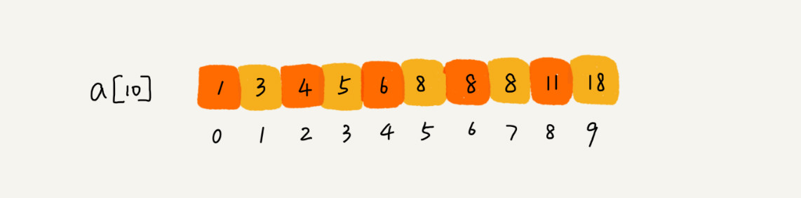

### 总结的二分变形问题

>二分查找是最简单的一种，即有序数据集合中不存在重复的数据，我们在其中查
找值等于某个给定值的数据。如果我们将这个问题稍微修改下，有序数据集合中存在重复的
数据，我们希望找到第一个值等于给定值的数据，这样之前的二分查找代码还能继续工作
吗？
> 
> 
> 

### 简单二分在数组元素有重复下存在问题的例子

比如下面这样一个有序数组，其中，a[5]，a[6]，a[7] 的值都等于 8，是重复的数据。我们
希望查找第一个等于 8 的数据，也就是下标是 5 的元素

如果我们用上一节课讲的二分查找的代码实现，首先拿 8 与区间的中间值 a[4] 比较，8 比
6 大，于是在下标 5 到 9 之间继续查找。下标 5 和 9 的中间位置是下标 7，a[7] 正好等于
8，所以代码就返回了。

### 查找第一个值等于给定值的元素

参见代码 V1

### 查找最后一个值等于给定值的元素

### 查找第一个大于等于给定值的元素

### 查找最后一个小于等于给定值的元素